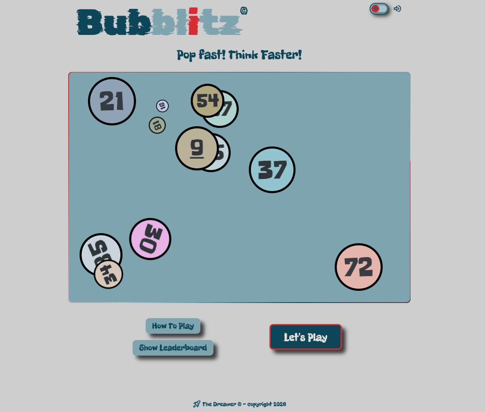
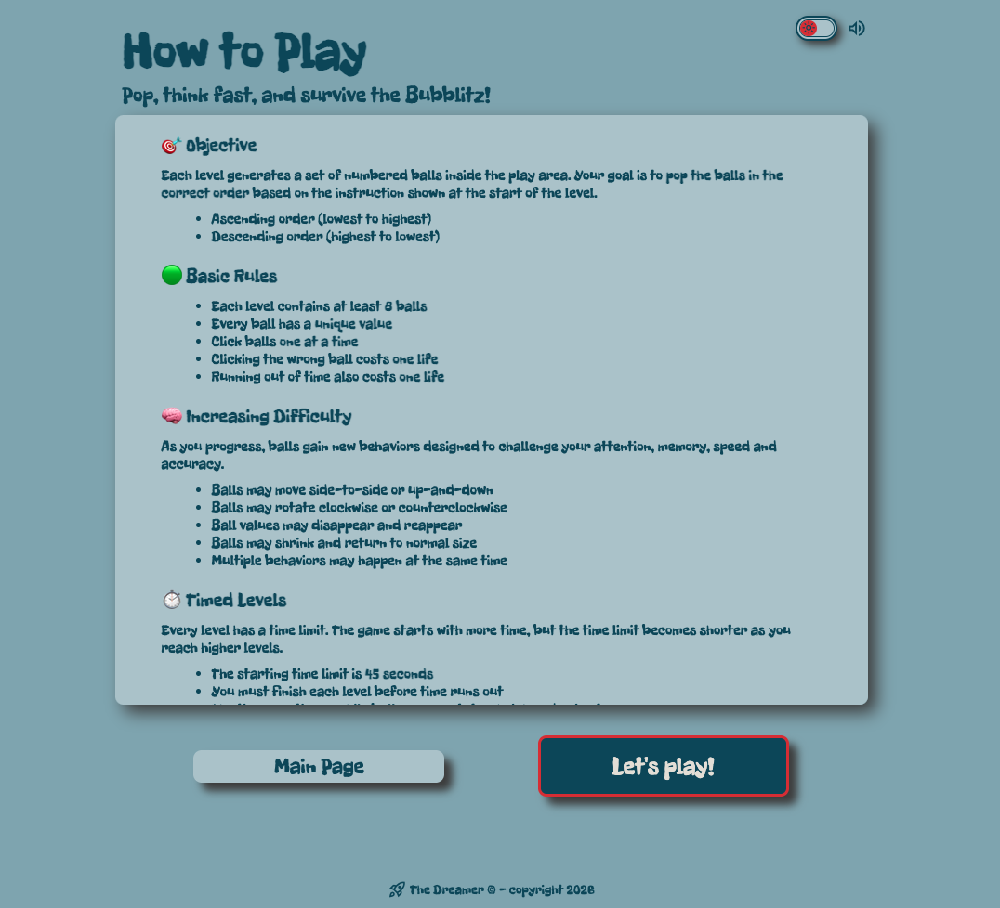
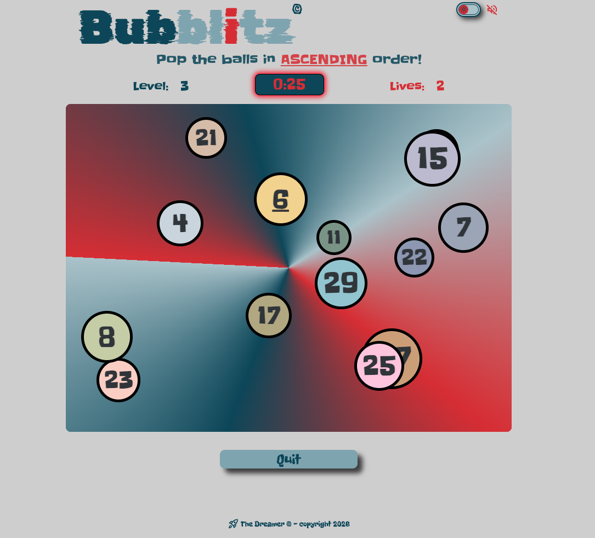
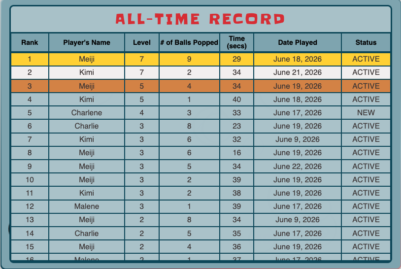
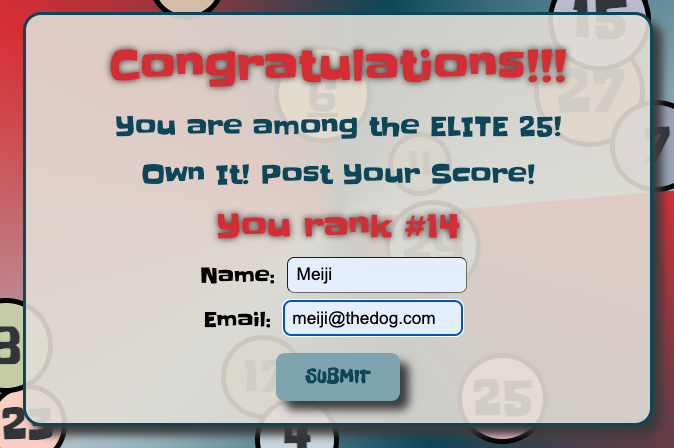
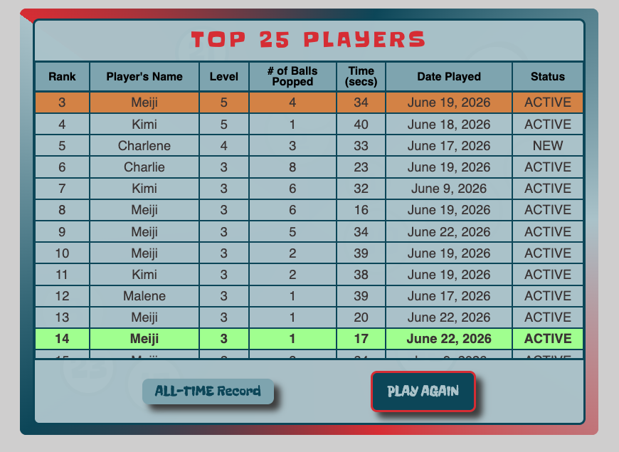
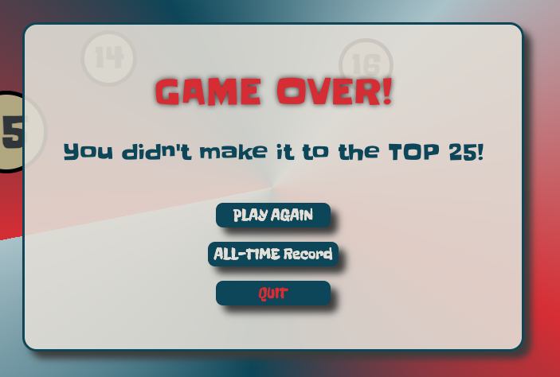
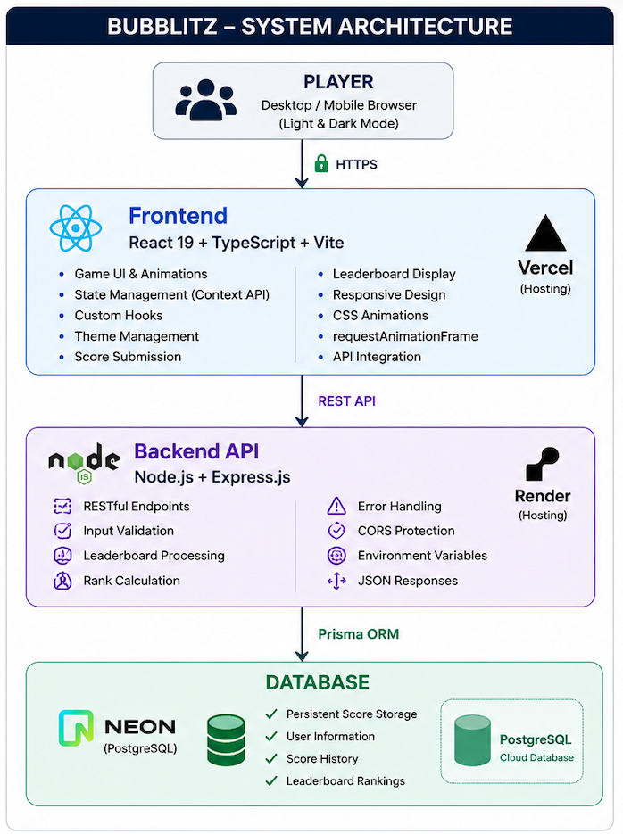
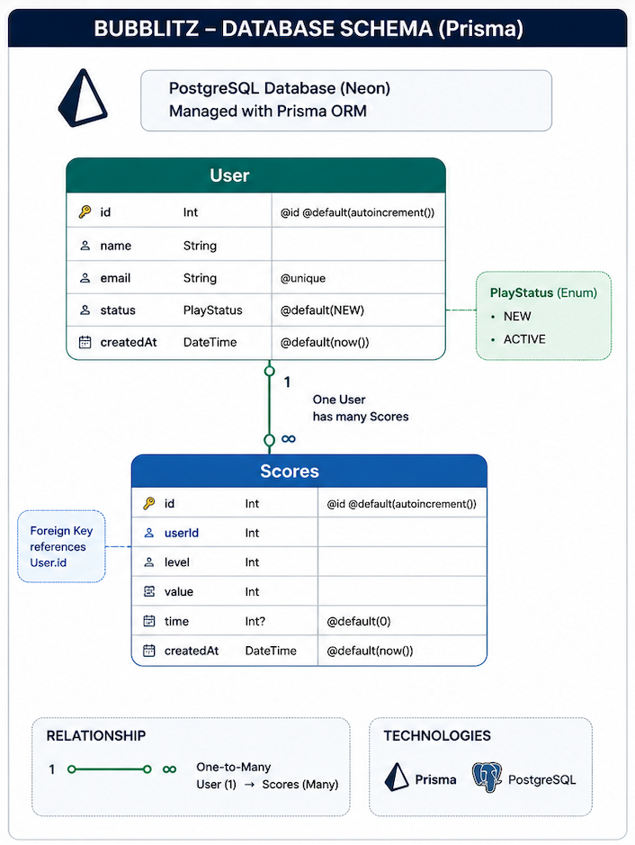
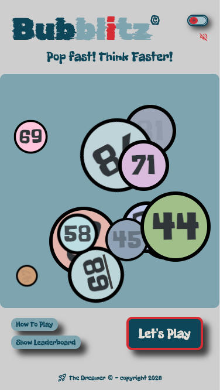

# 🎮 Bubblitz — Full-Stack Timed Reflex & Focus Number Game

**Bubblitz** is a full-stack browser-based game that challenges players to maintain focus, speed, and accuracy while reacting to increasingly complex visual behaviors under time pressure.

Built with a modern full-stack architecture, Bubblitz combines a highly interactive React front end with a scalable Node.js backend, PostgreSQL cloud database, persistent online leaderboards, and production cloud deployment.

The project demonstrates real-world software engineering practices including API development, database integration, cloud deployment, responsive design, state management, and performance-driven animation systems.

---

## 🏗️ System Architecture

---

## 🧠 Game Overview

At each level, players are presented with dynamically generated numbered balls.

### 🎯 Objective

Pop the balls in the required order:

* **Ascending** (lowest → highest)
* **Descending** (highest → lowest)

The required order changes dynamically every level, forcing players to remain focused and adapt quickly under pressure.

---

## 🏆 Online Leaderboard System

Bubblitz includes a fully integrated leaderboard powered by a cloud-hosted PostgreSQL database.

### Features

* Persistent score storage
* Online leaderboard rankings
* Top 25 qualification system
* Automatic rank calculation
* Score submission validation
* Server-side processing
* Real-time API communication

Players who achieve a qualifying score are prompted to submit their information for leaderboard inclusion.

---

## ⏱️ Timed Gameplay & Progression

* Starts at **Level 1**
* Time decreases at milestone levels
* Difficulty scales progressively
* Failure before timer expiration results in **Game Over**
* Bonus lives awarded every 10 levels
* Advanced behaviors unlock at higher levels

This creates a strong balance between:

* Speed
* Accuracy
* Pattern Recognition
* Decision Making Under Pressure

---

## ✨ Core Gameplay Features

* 🎲 Randomized Ball Generation
* 🔢 Ascending / Descending Challenges
* ❤️ Three-Life System
* ⏳ Progressive Timer Reduction
* 🏆 Persistent Online Leaderboard
* 🌗 Light & Dark Theme Support
* 🎯 Visual Feedback System
* 🔁 High Replayability

---

## 🌀 Advanced Ball Behaviors

As levels increase, balls gain independent behaviors that may occur simultaneously:

* 🏃 Dynamic Movement
* 🔄 Clockwise Rotation
* 🔁 Counter-Clockwise Rotation
* 👻 Value Vanishing & Reappearing
* 📏 Dynamic Size Transformation
* 🧠 Randomized Per-Ball Behaviors

The system is designed to scale difficulty without increasing code fragility.

---

## ⚙️ Full-Stack Architecture

### Frontend

Responsibilities:

* Game Rendering
* User Interaction
* Animation Engine
* Score Submission
* Leaderboard Presentation
* Theme Management

### Backend

Responsibilities:

* REST API Endpoints
* Score Validation
* Rank Calculation
* Leaderboard Processing
* Error Handling
* Environment Configuration

### Database

Responsibilities:

* Score Persistence
* Player Information Storage
* Ranking Calculations
* Historical Score Tracking

---

## 🛠️ Tech Stack

### Frontend

* React
* TypeScript
* Vite
* JavaScript (ES6+)
* HTML5
* CSS3

### Backend

* Node.js
* Express.js
* REST API Architecture

### Database

* PostgreSQL
* Neon Cloud Database
* Prisma ORM

### Cloud & Deployment

* Vercel
* Render

### Development Tools

* Git
* GitHub
* VS Code
* Chrome DevTools
* Firefox DevTools

---

## 🚀 Engineering Highlights

### Frontend Engineering

* React Context API
* Custom Hooks
* requestAnimationFrame
* Responsive Design
* Dynamic CSS Animations
* Theme Management

### Backend Engineering

* RESTful API Development
* Environment Variables
* CORS Configuration
* Server-Side Validation
* Error Handling

### Database Engineering

* Prisma ORM
* PostgreSQL Schema Design
* Database Migrations
* Persistent Data Storage

### Cloud Engineering

* Vercel Deployment
* Render Deployment
* Neon Database Hosting

---

## 🌗 Theme Support

* Light Mode
* Dark Mode
* Global Theme State
* Consistent Visual Experience

---

## 📸 Game Screenshots

<!-- ### Main Page -->

- **Main Page** — Landing screen featuring responsive design, light/dark theme support, animated UI elements, and quick access to gameplay and leaderboard functionality.

<!-- ### How To Play -->
- **How-To-Play Page** — Dedicated instruction page explaining gameplay mechanics, scoring rules, level progression, lives system, and advanced ball behaviors.

<!-- ### Gameplay -->
- **Gameplay Screen** — Live game interface showcasing the timer system, level progression, lives tracking, dynamic ball generation, animations, and real-time player interaction.

<!-- ### Online Leaderboard -->
- **All-Time Leaderboard** - Persistent online leaderboard displaying player rankings, scores, levels reached, completion times, and historical leaderboard records stored in PostgreSQL.

- **Top 25 Qualification Evaluation** - Server-validated qualification screen that determines whether a player's score ranks within the current Top 25 leaderboard before allowing score submission.

- **Top 25 Leaderboard Submission** - Dedicated leaderboard view displayed after successful qualification and score submission, highlighting the player's newly earned ranking position.

- **Game Over Screen** - End-of-game interface providing performance feedback, qualification status, replay options, leaderboard access, and score submission workflow.

- **System Architecture Diagram** - High-level overview of the full-stack architecture, illustrating communication between the React frontend, Express API, Prisma ORM, PostgreSQL database, and cloud hosting providers.

- **Database Schema Diagram - Visual representation of the PostgreSQL database structure, Prisma models, entity relationships, and score storage architecture powering the leaderboard system.

- **Responsive Mobile Experience** - Optimized mobile interface tested across desktop, tablet, and mobile browsers with adaptive layouts and touch-friendly interactions.

---

## 🎯 Project Goals

This project was built to:

* Demonstrate Full-Stack Development Skills
* Build Production-Ready Software
* Explore Advanced React Architecture
* Design REST APIs
* Integrate Cloud Databases
* Deploy Applications to Production
* Practice Real-World Software Engineering

---

## 👨‍💻 About This Project

Bubblitz evolved from a front-end game into a complete full-stack application.

The project demonstrates the ability to design, build, deploy, and maintain software across:

* Frontend Development
* Backend Development
* Database Design
* Cloud Infrastructure
* Application Deployment

---

## 🚀 Possible Future Enhancements

* 🏅 Achievement System
* 📊 Statistics Dashboard
* 👤 Player Profiles
* 🌎 Global Rankings
* 🤝 Multiplayer Competitions
* 📱 Enhanced Mobile Experience

---

## 📄 License

This project is created for educational, portfolio, and demonstration purposes.
